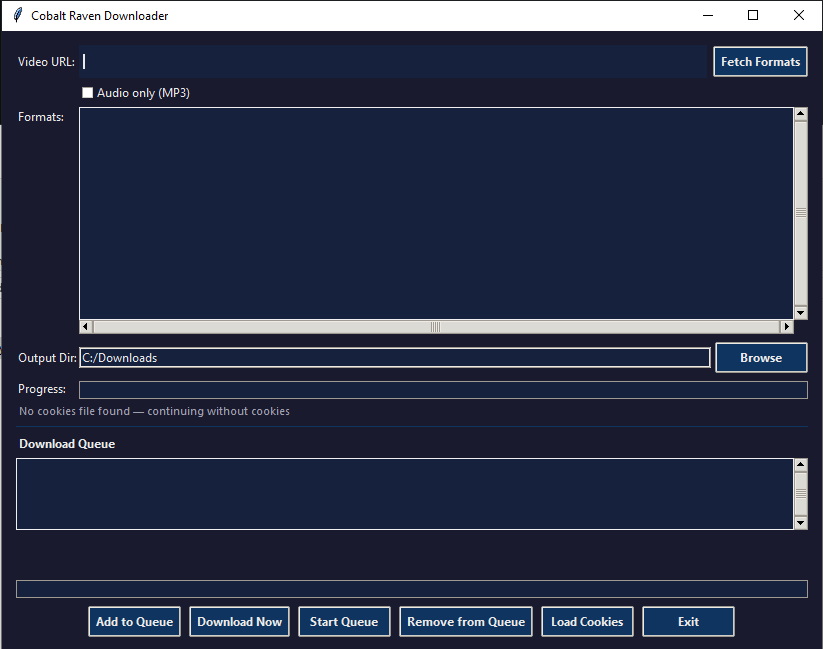
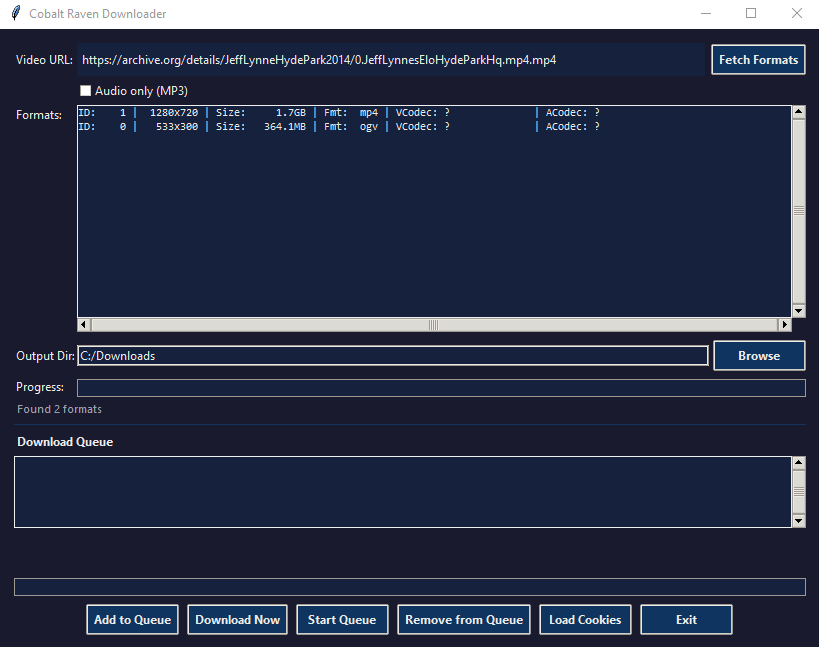

# Cobalt Raven Downloader

A Python/tkinter GUI for [yt-dlp](https://github.com/yt-dlp/yt-dlp) — download videos from YouTube and thousands of other supported sites without touching the command line.

Originally built to migrate videos between YouTube channels when reorganizing a content library. If you've ever needed to pull 70 videos off one channel to seed a new one, this is the tool for that.

[](https://github.com/earlywarning77/Cobalt_Raven_Downloader/archive/refs/heads/main.zip)

---




---

## Features

- **Format picker** — fetches and displays every available resolution and codec before you commit to a download
- **Audio-only mode** — extract MP3 at 192kbps via FFmpeg with one checkbox
- **Download queue** — add multiple URLs and formats, then run them all in sequence
- **Dual progress bars** — one for the current file, one for overall queue progress
- **Cookie support** — load cookies from JSON, SQLite (Firefox), or Netscape `.txt` format for age-restricted or member-only content
- **Threaded downloads** — UI stays fully responsive while downloading
- **Auto-retry** — retries failed format fetches up to 3 times automatically
- **Playlist guard** — strips playlist parameters from URLs so you get the single video, not the whole list
- **Dark theme UI** — easy on the eyes for long sessions

---

## Requirements

| Dependency | Version | Notes |
|---|---|---|
| Python | 3.x | |
| [yt-dlp](https://github.com/yt-dlp/yt-dlp) | 2026.03.x or newer | `pip install --upgrade yt-dlp` |
| [FFmpeg](https://ffmpeg.org/download.html) | Any recent | Required for MP3 extraction and muxing |
| [Node.js](https://nodejs.org/) | v22+ | Required for YouTube's JS challenge solver |

> **Note on Node.js:** YouTube now requires yt-dlp to solve a JavaScript challenge for every download. yt-dlp handles this automatically using Node.js — but Node must be installed and on your PATH. The app will download the required solver scripts from GitHub on first run via `--remote-components ejs:github`.

---

## Installation

```bash
# 1. Clone the repo
git clone https://github.com/earlywarning77/Cobalt_Raven_Downloader.git
cd Cobalt_Raven_Downloader

# 2. Install yt-dlp
pip install --upgrade yt-dlp

# 3. Install FFmpeg
# Windows: https://ffmpeg.org/download.html  (add to PATH)
# Or via winget:
winget install Gyan.FFmpeg

# 4. Install Node.js v22+ (if not already installed)
# https://nodejs.org/  or:
winget install OpenJS.NodeJS.LTS

# 5. Run
python crdownloader.py
```

---

## Usage

1. Paste a video URL into the **Video URL** field
2. Click **Fetch Formats** — available resolutions will populate the list
3. Select your preferred format from the list
4. Choose an output directory (defaults to `~/Downloads`)
5. Click **Download Now** for a single download, or **Add to Queue** to batch multiple videos
6. For audio-only, check **Audio only (MP3)** before fetching — no format selection needed

### Cookie support

For age-restricted or member-only content, click **Load Cookies** and select a cookie file:
- **JSON** — exported from browser extensions like *Get cookies.txt LOCALLY*
- **SQLite** — Firefox's `cookies.sqlite` (copied from your profile)
- **Netscape .txt** — standard format accepted by most tools

---

## Troubleshooting

**"n challenge solving failed" / formats not loading**
- Make sure Node.js v22+ is installed and on your PATH (`node --version` in a terminal)
- Update yt-dlp: `pip install --upgrade yt-dlp`
- If it was working and stopped, clear the cached solver: delete `%LOCALAPPDATA%\yt-dlp\challenge-solver` and retry

**"Skipping unsupported client tv_embedded"**
- You're on an old version of yt-dlp. Run `pip install --upgrade yt-dlp`

**FFmpeg not found**
- Make sure FFmpeg is installed and `ffmpeg` is accessible from your PATH

---

## License

GNU GPLv3 — see [LICENSE](LICENSE) for details.
